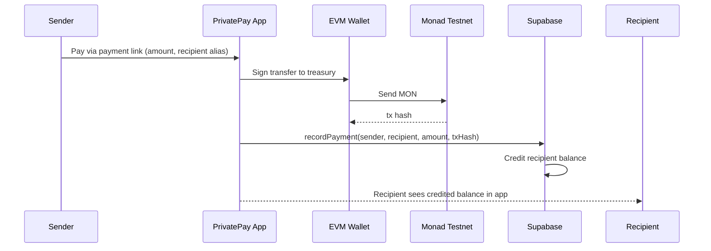
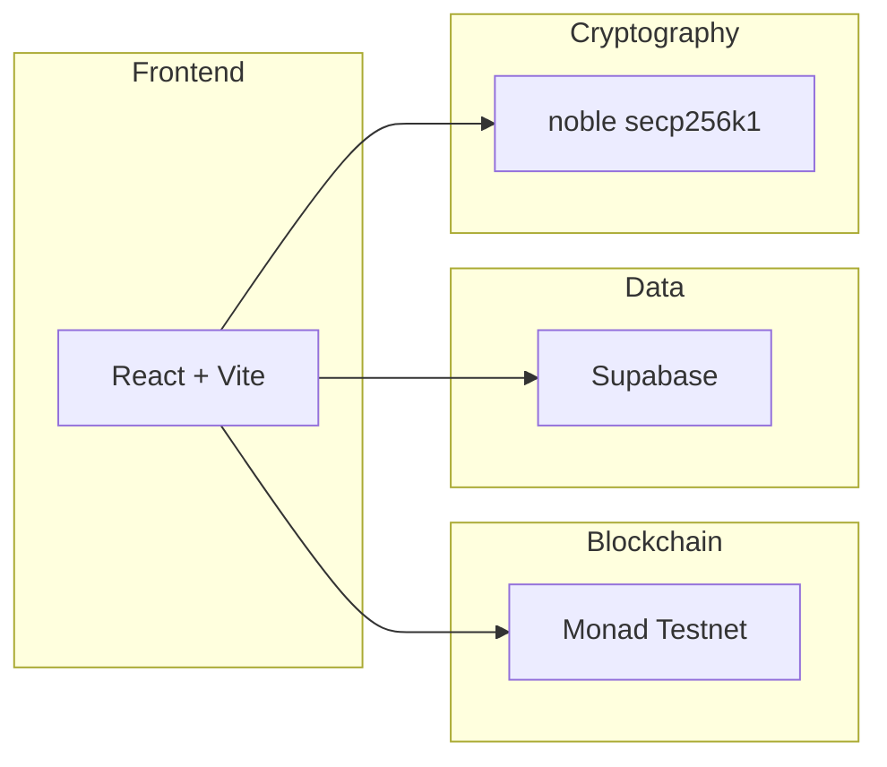
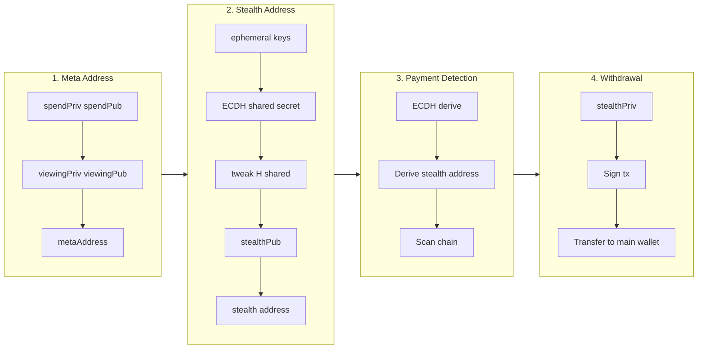
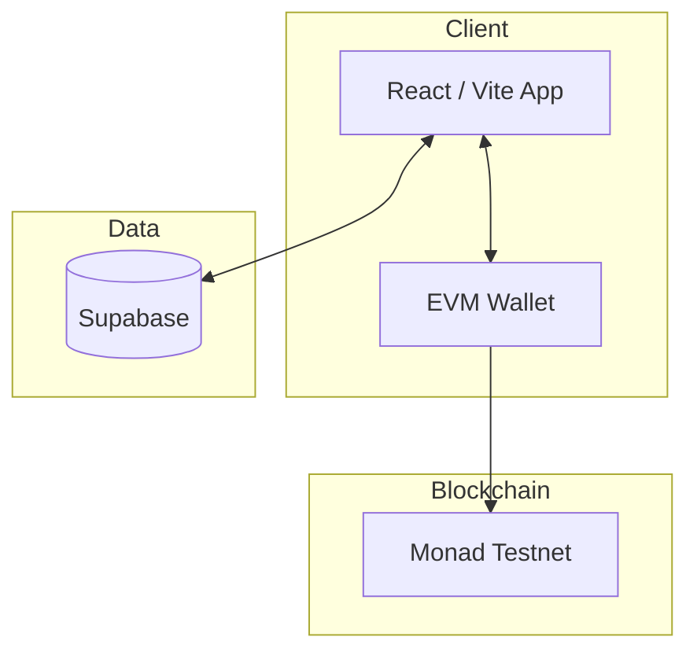
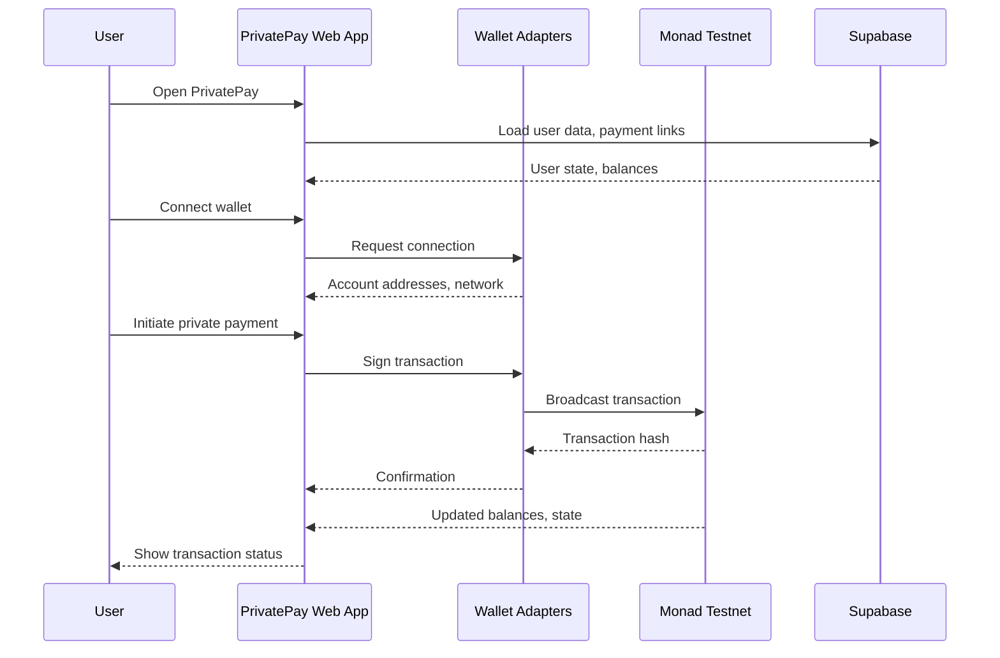
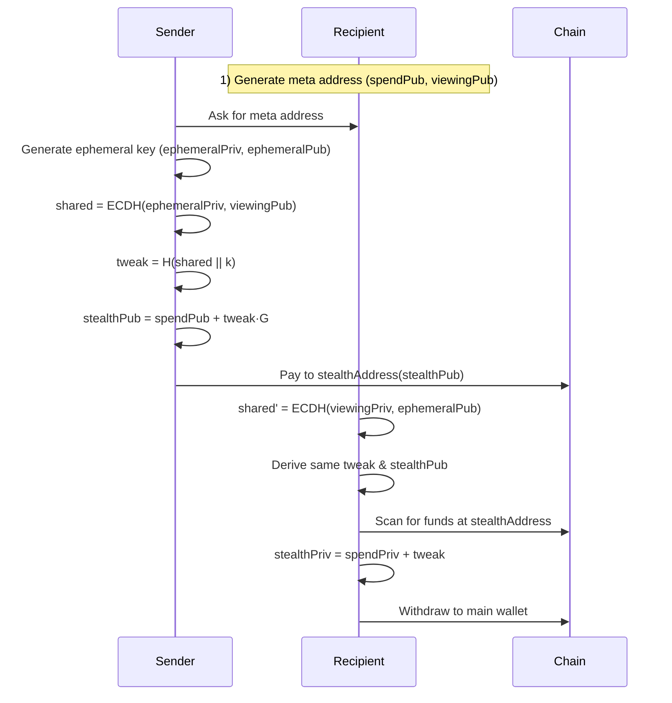

# PrivatePay 🐙

> The first on-chain untraceable, unidentifiable, private payments on Monad.
Powered by Elliptic Curve Diffie-Hellman (ECDH) + secp256k1 + BIP 0352 / EIP 5564 + ROFL DarkPool Mixer

Simply means “Stealth Crypto Payments using multilayer forks”

| | Link |
|---|------|
| **Pitch deck** | *https://docs.google.com/presentation/d/1epRVTSwU3T280627n6GII3M0YTNOai0EKIUS4GKGYh8/edit?usp=sharing* |
| **Live link** | *https://private-pay-monad.vercel.app/* | 
| **Demo video** | *https://testnet.monadvision.com/address/0x83CC763c3D80906B62e79c0b5D9Ab87C3D4D1646?type=Transactions* , *https://testnet.monadvision.com/address/0xa35Bd929a3554bf07908e3131a7Df305849Cd25F* |

---

## 🚨 The Problem: Financial Privacy is Broken

### Real-Life Story

**Alice**, a legendary dev, won the Monad Pune Hackathon and received **$700** in prize money.

**Bob**, another participant who also won at the same hackathon, had a co-founder who wasn’t trustworthy — the co-founder refused to admit receiving any prize money. Bob messaged all **3 winners** asking for the organizer’s wallet address. 1/3 winner shared it. On the explorer, that single address made it trivial to see who received what. Bob quickly inferred that **$1,500** had been split among three people and, in a couple of minutes and with basic intelligence tools like Arkham, Dune Analytics, etc. linked **every wallet to its owner**.

**That’s a serious concern.** Nobody wants the wallet that holds their real funds to be exposed. Bob — or anyone with the same info — could target those people for their own benefit.

### The Core Issues

❌ **Payments on public blockchains are NOT private**
- Traceable through tools like Arkham Intelligence
- Trackable via Dune Analytics and explorers
- Identifiable by anyone with basic skills

❌ **Results:**
- Fear of transacting
- Inconvenience for legitimate users
- Financial loss from targeted attacks
- Privacy violations for everyone

---

## ✅ The Solution: PrivatePay

**Where every transaction is fully private, anonymous, unidentifiable, and untrackable.**

### Core Benefits (current implementation)

- ✨ **Sender privacy**: Your wallet is never linked to the transaction
- ✨ **Receiver privacy**: Recipients' identities remain hidden
- ✨ **Observer blindness**: Third parties see nothing linkable
- ✨ **Simple UX**: Like Stripe links, but every transaction is a new, invisible wallet

### Key Features (current)

🔒 **Infinite Untraceable Stealth Accounts**
- Each payment generates a fresh stealth sub-account
- Unlimited transactions, unlimited mixers
- One single DarkPool

💼 **Static Payment Links**
- Share a single payment link (e.g., `amaan.privatepay.monad`)
- Each access generates a unique stealth address
- No complex setup required

🔐 **Complete Unlinkability**
- Sender cannot identify receiver
- Receiver cannot identify sender
- Observers see nothing linkable


### Payment Link → Treasury Flow (Monad)



Recipients can withdraw their credited balance to their wallet (Send & Withdraw on Monad Testnet).

---

## 🔧 Technology Stack

### Privacy Infrastructure

**Currently in use (Monad):** Treasury-based flow — sender → treasury on-chain; recipient balance and withdrawals via Supabase + relayer.

**Roadmap / in progress:**

```
🔐 Cryptographic Primitives (for future stealth flow)
├─ Secp256k1 elliptic curve cryptography
├─ SHA3-256 hashing for address derivation
└─ Secure random number generation

🤝 ECDH (Elliptic Curve Diffie-Hellman)
├─ Shared secret computation
├─ Key exchange protocol
└─ Perfect forward secrecy

🎭 Stealth Address Protocol (SSAP) — BIP 0352 / EIP 5564
├─ Unique address per transaction (target)
└─ Complete unlinkability

🌊 DarkPool Mixer (In Progress)
├─ Runtime Offchain Logic (ROFL) integration
├─ Homomorphic encryption
└─ Monero-style Ring Signatures & RingCT

🔍 Automated Monitoring
├─ Event-based transaction detection
├─ Event-based backup system
└─ Resilient recovery mechanism
```

### Built With



- **Blockchain**: Monad Testnet (EVM) — single chain only
- **Frontend**: React + Vite + ConnectKit / wagmi
- **Database**: Supabase (PostgreSQL)
- **Cryptography**: @noble/secp256k1, @noble/hashes

---

## 📊 Market Opportunity

### Total Addressable Market (TAM)

| Market | Size | Growth |
|--------|------|--------|
| 💰 Global payment processing | $160B annually | - |
| 🪙 Crypto payment market | $624M | 16.6% CAGR |
| 🔒 Privacy-focused solutions | $1.2B | Growing |
| 👥 Crypto users worldwide | 590M+ | Expanding |

### Target Users

- **Individuals**: Privacy-conscious crypto users
- **Freelancers**: Receive payments without exposing income
- **Businesses**: Accept payments without revealing revenue
- **DAOs**: Anonymous treasury management
- **Hedge Funds**: Private money movements
- **High Net Worth**: Protection from targeted attacks

---

## 🎯 Competitive Landscape

### Why PrivatePay Wins


---

## ⚡ Future Roadmap

### Phase 1: Core Platform ✅
- ✅ Stealth address generation
- ✅ Payment link system
- ✅ Dashboard and monitoring

### Phase 2: Enhanced Privacy 🚧
- 🚧 Zero-knowledge proofs (Plonky2)
- 🚧 Bulletproofs for amount hiding
- 🚧 Advanced DarkPool integration
- 🚧 ROFL-style monitoring

### Phase 3: Payment Expansion 🔮
- 🔮 Private credit and debit card payments
- 🔮 Disposable wallets

### Phase 4: Enterprise Features 🔮
- 🔮 Hedge fund money moves
- 🔮 API marketplace
- 🔮 White-label solutions
- 🔮 Compliance tools

### Endless Possibilities
- No more "James Waynn Exposer" incidents
- End to HyperLiquid wallet reveals
- Protection for high-value transactions
- Privacy for everyone, everywhere

---

### Cryptographic Flow



**Steps (summary):**

1. **Meta Address** — Generate spend key pair and viewing key pair; meta address = (spendPub, viewingPub).
2. **Stealth Address** — Ephemeral key → ECDH shared secret → tweak → stealth public key → stealth address.
3. **Payment Detection** — Recipient derives same stealth address via ECDH(viewingPriv, ephemeralPub), scans chain.
4. **Fund Withdrawal** — stealthPriv = spendPriv + tweak; sign and transfer to main wallet.

---

## 🧠 System Architecture Overview

Below is a concise, technical view of how the PrivatePay system is wired (Monad Testnet, Supabase).

### Component Overview



### High-Level Architecture



At the center is the **React/Vite** app, which talks to your EVM wallet, Monad Testnet, and Supabase.

### Stealth Meta-Address Flow (target architecture)

*This flow is the intended end-state for full on-chain privacy; the current Monad app uses the treasury + ledger flow above.*



The app today uses the **Payment Link → Treasury Flow** (send to treasury, record in Supabase, withdraw from treasury). Wallet connection: `src/providers/ConnectKitProvider.jsx` — Monad Testnet (EVM) via wagmi/ConnectKit.

---

## 🚀 Getting Started (Developers)

### 1. Prerequisites

- **Node.js** ≥ 20.x (tested with Node 22.x)
- **npm** ≥ 10.x
- Browser wallet: **EVM wallet** (ConnectKit) on Monad Testnet

### 2. Install Dependencies

```bash
cd Private-Pay
npm install
```

### 3. Environment Variables (root `.env`)

Copy `.env.example` to `.env` and fill in your values:

```bash
cp .env.example .env
```

| Variable | Description |
|----------|-------------|
| `VITE_APP_ENVIRONMENT` | `dev` or `production` |
| `VITE_WEBSITE_HOST` | App host (e.g. `privatepay.monad`) |
| `VITE_BACKEND_URL` | Optional backend/relayer URL (e.g. `http://localhost:3400`) |
| `VITE_WALLETCONNECT_PROJECT_ID` | [WalletConnect Cloud](https://cloud.walletconnect.com) project ID (required for ConnectKit) |
| `VITE_SUPABASE_URL` | Supabase project URL (Settings → API) |
| `VITE_SUPABASE_ANON_KEY` | Supabase anonymous key (public, safe for frontend) |
| `VITE_SUPABASE_SERVICE_ROLE_KEY` | Supabase service role key (backend only; keep secret) |
| `VITE_MONAD_TREASURY_ADDRESS` | Treasury wallet address that receives payments |
| `VITE_TREASURY_PRIVATE_KEY` | Treasury private key (hex, no `0x`) for relayer/withdrawals — **keep secret** |
| `VITE_MONAD_RPC_URL` | Monad Testnet RPC (default: `https://testnet-rpc.monad.xyz/`) |
| `VITE_MONAD_CHAIN_ID` | `10143` for Monad Testnet |
| `VITE_MONAD_EXPLORER` | Block explorer URL (e.g. `https://testnet.monadexplorer.com`) |

See `.env.example` for the full template and `docs/guides/ENVIRONMENT_SETUP.md` for detailed setup.

### 4. Run

```bash
npm run dev   # http://localhost:5173
```

---

## 🧩 Project Structure (Key Folders)

```text
src/
  components/
    home/                # Dashboard cards & charts
    monad/               # Monad hub (connect, send link)
    payment/             # Payment & payment link components
    shared/              # Navbar, header, icons, dialogs

  pages/
    IndexPage.jsx        # Landing/dashboard
    MonadPage.jsx        # Monad hub (connect, link to send)
    SendPage.jsx         # Send & withdraw (Monad)
    PointsPage.jsx       # Points & rewards
    PaymentLinksPage.jsx
    TransactionsPage.jsx

  providers/
    RootProvider.jsx     # Composes all context providers
    ConnectKitProvider.jsx  # EVM wallet (Monad)

  lib/
    (Monad uses ethers/wagmi in hooks and SendPage)
    supabase.js          # Payment links, balances, points

# Monad-only (no aleo folder)
```

---

## 🧪 Testing

- **Monad / frontend**

  ```bash
  npm run test
  npm run test:e2e
  ```

See `docs/guides/` for setup and deployment.
